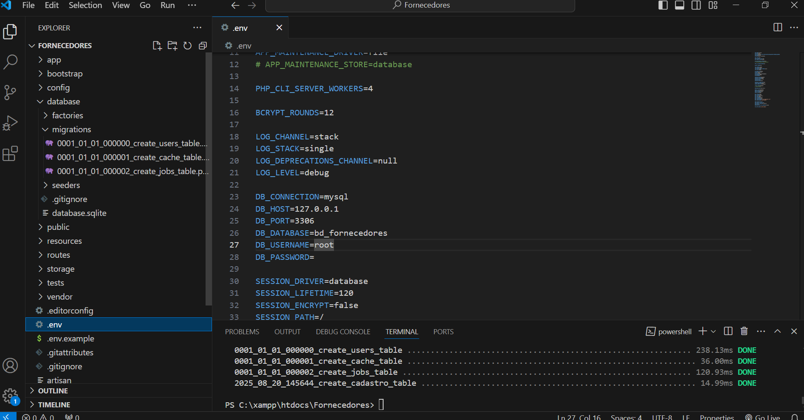
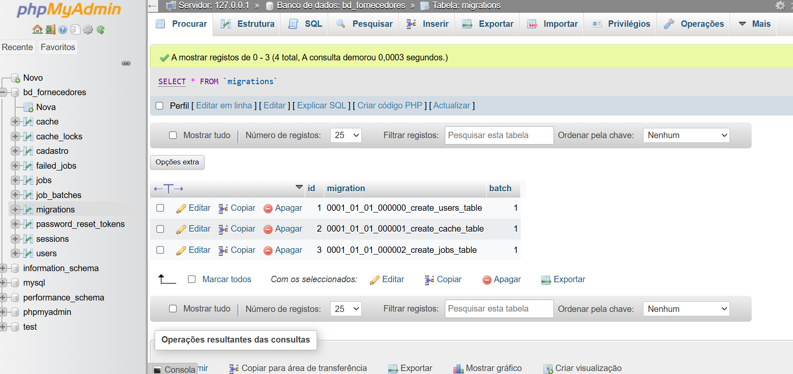
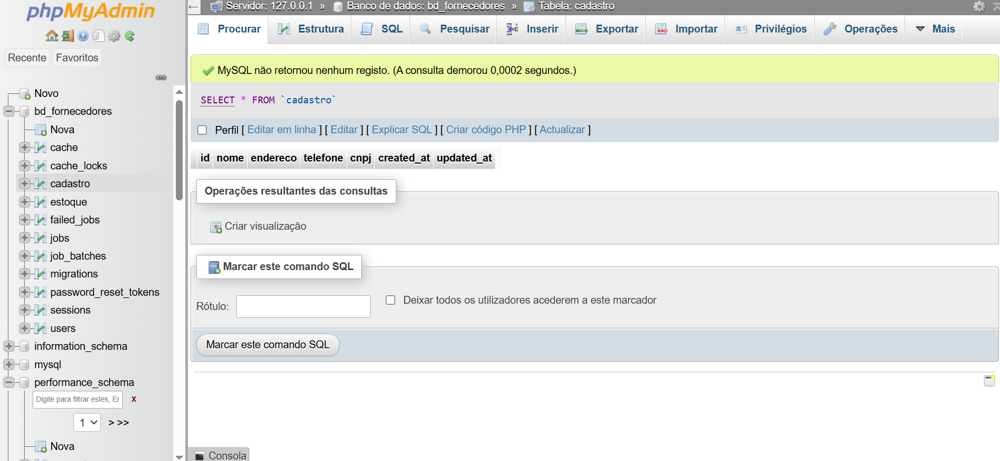
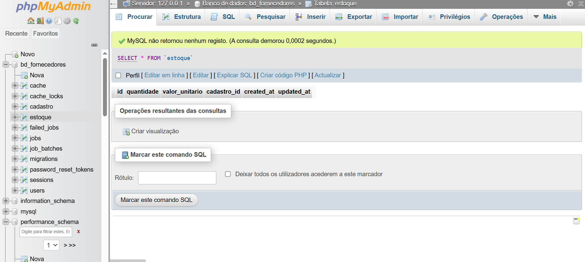
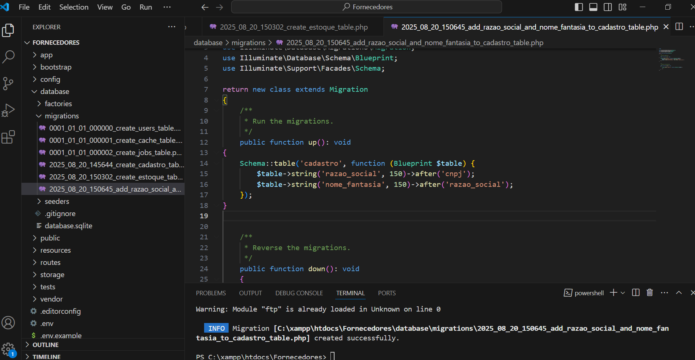
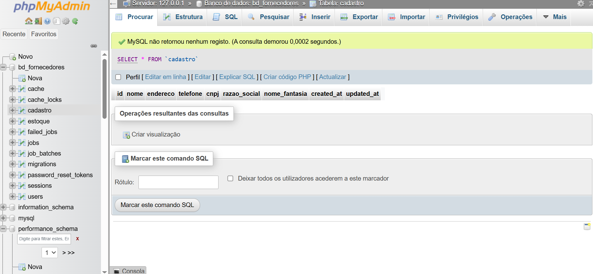

# 🏭 Projeto Laravel - Fornecedores

Este repositório contém a atividade prática desenvolvida com **Laravel** e **MySQL** para gerenciamento de fornecedores e estoque.

---

## 🚀 Tecnologias Utilizadas
- PHP
- Laravel Framework
- MySQL
- Composer
- VS Code

---

## 📋 Etapas Realizadas

1. **Criação do Projeto Laravel no htdocs do xammp**
   ```bash
   composer create-project laravel/laravel Fornecedores
   cd Fornecedores
``
- Alteração no .env
<p align="center"></p>

2. **Criação das Migrations**

<p align="center"></p>

- cadastro → com os campos: id, nome, endereço, telefone, cnpj.
```
php artisan make:migration create_cadastro_table --create=cadastro
```

No arquivo gerado colocar
```
public function up(): void
{
    Schema::create('cadastro', function (Blueprint $table) {
        $table->id(); // ID (chave primária)
        $table->string('nome', 100);
        $table->string('endereco', 150);
        $table->string('telefone', 20);
        $table->string('cnpj', 20)->unique();
        $table->timestamps();
    });
}
```  

<p align="center"></p>
- estoque → com os campos: quantidade, valor_unitario e chave estrangeira para cadastro.

```
php artisan make:migration create_estoque_table --create=estoque
```
No arquivo gerado colocar:

```
public function up(): void
{
    Schema::create('estoque', function (Blueprint $table) {
        $table->id();
        $table->integer('quantidade');
        $table->decimal('valor_unitario', 10, 2);
        
        // ID como chave estrangeira para cadastro
        $table->unsignedBigInteger('cadastro_id');
        $table->foreign('cadastro_id')->references('id')->on('cadastro')->onDelete('cascade');

        $table->timestamps();
    });
}
```

<p align="center"></p>

- Alteração em cadastro → adicionados campos razão social e nome fantasia.
```
php artisan make:migration add_razao_social_and_nome_fantasia_to_cadastro_table --table=cadastro

```
No arquivo gerado colocar:
```
public function up(): void
{
    Schema::table('cadastro', function (Blueprint $table) {
        $table->string('razao_social', 150)->after('cnpj');
        $table->string('nome_fantasia', 150)->after('razao_social');
    });
}
```
<p align="center"></p>

3. **Compilar as migrations**
```
php artisan migrate

```

**Resultado Final**
<p align="center"></p>

